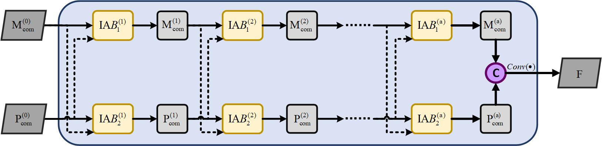

# CDFormer

This repo is the official implementation for CDFormer: A Transformer-Based Network Focusing Correlation and Difference for Pansharpening  


## Architecture of CDformer


# IAB


# CFAM




# SFAM


# Prerequisites

This environment is mainly based on python=3.6 with CUDA=10.2

```shell
conda create -n cdformer python=3.6
conda activate cdformer
conda install pytorch=1.7.1 torchvision=0.2.2 cudatoolkit=10.2
pip install mmcv==1.2.7
conda install gdal=3.1.0 -c conda-forge
conda install scikit-image=0.17.2
pip install scipy==1.5.3
pip install gpustat==0.6.0
pip install numba==0.53.1 
pip install einops==0.3.0 
pip install timm==0.3.2
pip install sewar==0.4.4
```


# Test with the pretrained Model

Due to the large size of the dataset, we only provide some samples in './data' to verify the code.

```shell
conda activate cdformer
export CUDA_VISIBLE_DEVICES='0';
python main.py -c configs/cdformer.py
```

You can modify the config file 'configs/panformer.py' for different purposes.

